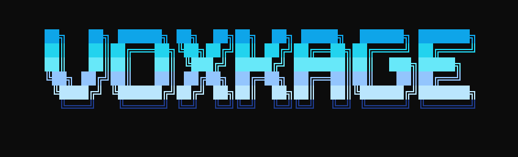

<div align="center">
 
  <p align="center">
    
  </p>

  <br>
  <h1>VoxKage</h1>
  <h3><i>OS-Level Agentic AI — Autonomous. Persistent. Self-Improving.</i></h3>
  <p>A local AI coordinator that injects a unified network of MCP servers into your active CLI, with a cognitive core that classifies, plans, reflects, and evolves on every single task.</p>
  <br>

  <p align="center">
    <a href="https://pypi.org/project/voxkage/" target="_blank">
      
    </a>
    
    
    
  </p>

  <p align="center">
    
    
    
  </p>

  <br>
  <hr width="100%">
  <br>
</div>

<p align="center">
  [<a href="#what-is-voxkage"><strong>What Is VoxKage</strong></a>] •
  [<a href="#architecture"><strong>Architecture</strong></a>] •
  [<a href="#cognitive-core"><strong>Cognitive Core</strong></a>] •
  [<a href="#mcp-servers"><strong>MCP Servers</strong></a>] •
  [<a href="#installation"><strong>Installation</strong></a>] •
  [<a href="#development"><strong>Development</strong></a>] •
  [<a href="#plugins"><strong>Plugins</strong></a>] •
  [<a href="#troubleshooting"><strong>Troubleshooting</strong></a>]
</p>

<br>
<hr width="100%">
<br>

<a name="what-is-voxkage"></a>
## What Is VoxKage?

VoxKage is an open-source, system-level AI coordinator for Windows and macOS. It is not a chatbot. It is not an API wrapper.

It is a **daemon + MCP server network** that installs once via `pipx` and from that point sits on your system, injecting a full suite of locally-running tool servers directly into whichever coding CLI you use — Antigravity (`agy`), OpenCode, or Claude Code. Every turn, the **Cognitive Core** classifies your intent, generates a domain-specific task plan, runs a risk audit, executes, reflects on quality, and writes what it learned to a persistent performance profile. Over time, VoxKage autonomously corrects its own classification errors and evolves its own behavioral rules.

**What makes VoxKage different from standard MCP setups:**
- A self-improving cognitive layer that runs on *every* turn, not just when you ask for it
- SQLite FTS5 RAG built directly into the core package — no model downloads, no GPU, available instantly
- Two-track persistent memory: problem/solution logs (self-healing) + a user Soul profile (personalization)
- Parallel background task spawning: delegate long jobs to a sub-agent while you continue working
- Remote control via Telegram — send commands to your machine from your phone

---

<a name="architecture"></a>
## Architecture

```
┌──────────────────────────────────────────────────────────────────┐
│                     pipx install voxkage                         │
│                            │                                     │
│                     voxkage  (CLI entrypoint)                    │
│                    /         │           \                       │
│           voxkage init   voxkage tray   voxkage status           │
└──────────────────────────────────────────────────────────────────┘
                              │
              ┌───────────────┼────────────────┐
              ▼               ▼                ▼
       Antigravity CLI    OpenCode CLI    Claude Code CLI
       (agy)              (~/.config/     (CLAUDE.md)
       (GEMINI.md)         opencode/)
              │               │                │
              └───────────────┼────────────────┘
                              │
              ┌───────────────▼────────────────────────────────┐
              │         Shared MCP Server Network              │
              │                                                │
              │  cognitive-core   rag        memory   tasks   │
              │  coding (ACE)     websearch  system   browser │
              │  gui              oscontrol  session  notify  │
              │  github           telegram   email    health  │
              │  file / fileops   devserver  download  media  │
              └────────────────────────────────────────────────┘
                              │
              ┌───────────────▼────────────────────────────────┐
              │         Persistent Local State (~/.voxkage/)   │
              │                                                │
              │  rag/rag_database.db     SQLite FTS5 index     │
              │  memory.jsonl            problem/solution log  │
              │  user_profile.json       user Soul profile     │
              │  cognitive/              performance profiles  │
              │  brain/                  session logs + plans  │
              └────────────────────────────────────────────────┘
```

### Engine Routing

VoxKage reads `~/.voxkage/config.json` to determine which CLI to launch:

| Engine | Config value | Where it injects |
|---|---|---|
| Antigravity (`agy`) | `"antigravity"` | `~/.gemini/config/mcp_config.json` + `GEMINI.md` |
| OpenCode | `"opencode"` | `~/.config/opencode/opencode.json` + `AGENTS.md` |
| Claude Code | `"claude"` | `CLAUDE.md` in the project root |

All three engines share the same MCP server processes and the same local data directory. Switching engines does not lose context.

---

<a name="cognitive-core"></a>
## The Cognitive Core

The cognitive core (`voxkage-cognitive-core`) is what separates VoxKage from a plain MCP bundle. It is a mandatory metacognitive gate that runs on **every single turn** before any tool is called. It costs less than 1ms — the entire classification pipeline is rule-based with zero LLM calls.

### How a turn works

```
User message
     │
     ▼
start_turn(user_message)
  ├─ Classify intent: conversation? task?
  ├─ If task: detect domain (11 domains) + tier (1-3)
  ├─ Load domain-specific checklist
  ├─ Score anti-pattern risks from past failures
  └─ Return task_id, domain, tier, checklist, warnings

     │
     ▼ (Tier-dependent)

Tier 1 (Quick)     → execute → learn() → deliver
Tier 2 (Standard)  → pre_mortem() → execute → reflect() → learn()
Tier 3 (Complex)   → pre_mortem() → execute + checkpoint() → reflect() → verify() → learn()

     │
     ▼
learn(task_id, outcome)
  ├─ Update domain success rate
  ├─ Calibrate confidence model
  ├─ Analyze execution trace for anti-patterns
  └─ Write to persistent profile
```

### Domain Classification

VoxKage classifies every task into one of **11 domains**, each with its own checklist:

`coding` · `frontend` · `backend` · `research` · `system` · `devops` · `data` · `planning` · `analysis` · `creative` · `general`

Classification is done via a multi-signal scoring pipeline in `intent.py`:
- Action verb scoring + structural task header detection
- Semantic keyword boosting per domain (verb-noun map with negative lookahead exclusions)
- Conversational vs. task gating (prevents vague messages defaulting to conversation)
- Recursive greeting/prefix stripping (`"hey jarvis can you..."` correctly strips to the core query)
- Explicit user header parsing (`Domain: research` in the message overrides classifier)

### Recursive Self-Improvement

The `learning.py` module implements the self-evolution loop:

- **Anti-pattern tracking**: When `reflect()` or `verify()` finds a failure, the pattern is stored in `~/.voxkage/cognitive/anti_patterns.json`. The next call to `start_turn()` surfaces it as a warning.
- **Confidence calibration**: `learn()` tracks stated vs. actual confidence per domain and computes a calibration score. Over time, the model becomes accurately calibrated (not sandbagging, not overconfident).
- **Rule evolution**: `evolve_cognitive_rules()` promotes repeated correction patterns into permanent behavioral rules. `optimize_cognitive_core()` prunes stale rules and deduplicates the anti-pattern registry.
- **Checklist evolution**: Corrections made via `user_corrected()` generate new domain-specific checklist items that persist across all future tasks in that domain.

### Module Layout (cognitive/)

| File | Responsibility |
|---|---|
| `cycle.py` | Turn gating, `start_turn`, `pre_mortem`, `checkpoint` |
| `evaluation.py` | `reflect`, `verify`, `refine`, `verify_code_file`, `generate_critique` |
| `learning.py` | `learn`, `user_corrected`, `optimize_cognitive_core`, `evolve_cognitive_rules`, `get_profile` |
| `intent.py` | Rule-based intent classification, domain scoring, tier detection |
| `constants.py` | Domain keyword maps, action verb patterns, guard windows |
| `analyzer.py` | Anti-pattern scoring, execution trace analysis, confidence calibration |
| `storage.py` | All disk I/O: profiles, checklists, session state, anti-patterns |

---

<a name="mcp-servers"></a>
## MCP Server Suite

All 22 MCP servers ship inside the package and are registered automatically by `voxkage init`.

### Core Intelligence

| Server | Tools | Description |
|---|---|---|
| `cognitive-core` | `start_turn`, `pre_mortem`, `checkpoint`, `reflect`, `verify`, `refine`, `learn`, `user_corrected`, `optimize_cognitive_core`, `evolve_cognitive_rules`, `get_profile` | Metacognitive loop. Mandatory on every turn. |
| `voxkage-rag` | `index_document`, `query_rag`, `check_and_index`, `index_directory`, `list_indexed_documents`, `delete_from_rag` | SQLite FTS5 full-text search RAG. SHA256 change detection. Dynamic filename boosting in rankings. Indexes PDFs, Word, Excel, PowerPoint, and all code file types. Built into core — no extra install needed. |
| `voxkage-memory` | `log_problem`, `log_solution`, `search_memory`, `remember_user`, `recall_user`, `get_user_profile`, `set_trusted_action`, `check_trusted` | Two-track persistent memory. Track 1: problem/solution JSONL log with TF-IDF retrieval. Track 2: User Soul — a permanent structured profile (preferences, habits, identity) that is never cleared. |
| `voxkage-coding` | `coding_thinking`, `get_code_skeleton`, `update_coding_plan`, `get_coding_plan` | Agentic Coding Engine (ACE). 5-phase pipeline: decompose → RAG-first awareness → knowledge gap fill → plan → execute+verify. `get_code_skeleton` uses Python AST to return class/function signatures without full file content (saves ~97% of token usage on large files). |
| `voxkage-tasks` | `spawn_task`, `check_tasks`, `get_task_result`, `cancel_task`, `complete_task`, `log_step` | Background sub-agent spawner. Delegates long-running jobs to a hidden CLI process (agy or OpenCode) while the main session stays free. The sub-agent has full MCP access and reports back via `complete_task()`. |
| `voxkage-session` | `create_session_log`, `list_sessions`, `get_session_log`, `search_sessions` | Cross-session structured logging. Session logs are shared across Antigravity, OpenCode, and Claude Code, so context from one CLI is retrievable in another. |

### OS & System Control

| Server | Key Tools | Description |
|---|---|---|
| `voxkage-system` | `run_shell_command`, `get_system_info`, `get_running_processes`, `kill_process`, `open_application`, `press_hotkey`, `type_text`, `set_volume`, `set_brightness`, `toggle_wifi`, `toggle_bluetooth`, `power_action` | Full system control: processes, keyboard/mouse automation, audio, display, networking, power management. |
| `voxkage-oscontrol` | `copy_item`, `rename_item`, `create_folder`, `find_duplicates`, `compress_folder`, `extract_archive`, `compress_image`, `resize_image`, `set_wallpaper`, `get_disk_usage` | File system operations, archive management, image processing, disk analysis. |
| `voxkage-file` | `smart_open`, `browse_directory`, `analyze_specific_file`, `find_and_analyze_file`, `take_screenshot` | Intelligent file browser and analyzer. |
| `voxkage-fileops` | `create_file`, `edit_file`, `delete_file`, `convert_file`, `list_directory` | File creation and editing operations. |
| `voxkage-health` | `health_check`, `get_processes`, `scan_junk_files`, `clean_junk_files`, `get_security_status`, `get_disk_analysis` | System health monitoring and maintenance. |
| `voxkage-gui` | `get_desktop_state`, `get_open_files`, `gui_step`, `read_active_document` | GUI interaction and desktop state reading. |
| `voxkage-notify` | `notify`, `notify_task_done` | Toast and audio notifications on task completion. |

### Web & Data

| Server | Key Tools | Description |
|---|---|---|
| `voxkage-websearch` | `web_search`, `web_fetch`, `web_search_parallel`, `web_fetch_parallel`, `web_search_deep` | Headless search via DuckDuckGo (`ddgs`) + article extraction via `trafilatura`. No browser overhead for simple queries. Parallel fetch for multi-source research. |
| `voxkage-browser` | `open_url`, `click`, `fill`, `take_screenshot`, `dom_execute_js`, `lighthouse_audit`, `get_network_request` | Full Playwright browser automation. DOM interaction, JS execution, performance auditing. Requires `voxkage install browser`. |

### Integrations

| Server | Key Tools | Description |
|---|---|---|
| `voxkage-github` | `github_clone_repo`, `github_smart_commit`, `github_pull`, `github_actions_list`, `github_get_job_logs`, `github_list_my_repos` | Git operations, commit automation, Actions log fetching, repo management. |
| `voxkage-telegram` | `telegram_send_message`, `telegram_send_file`, `telegram_check_inbox`, `telegram_check_reply` | Remote command execution and file transfer via Telegram. A `telegram_watcher.py` daemon polls for inbound messages. |
| `voxkage-email` | `check_email`, `read_email`, `send_email`, `reply_to_email`, `get_email_stats` | Gmail read, send, draft, and archive via Google API. |
| `voxkage-media` | `search_spotify`, `play_spotify_selection`, `play_user_playlist`, `media_control` | Spotify playback control and search. |
| `voxkage-download` | `download_file`, `download_images`, `run_installer`, `get_download_status` | Managed file downloads with progress tracking. |
| `voxkage-devserver` | `detect_project_type`, `start_dev_server`, `stop_server`, `get_server_status`, `wait_for_server` | Dev server lifecycle management for Next.js, Vite, Flask, FastAPI, and more. |

---

<a name="installation"></a>
## Installation

### Prerequisites

- **Python 3.10+**
- **pipx** (isolated CLI installer)
- One of: **Antigravity CLI** (`agy`), **OpenCode CLI**, or **Claude Code**

### 1. Install pipx

```powershell
pip install pipx
pipx ensurepath
```

> **Important**: Close and reopen your terminal after `pipx ensurepath` for PATH changes to take effect. If `voxkage` is still not recognized, manually add `%USERPROFILE%\.local\bin` to your User PATH.

### 2. Install VoxKage

```powershell
pipx install voxkage
```

This installs the full core package (~80 MB) including the SQLite FTS5 RAG engine, cognitive core, all MCP servers, and OS integrations. No capability packs needed for the core workflow.

### 3. Run the Setup Wizard

```powershell
voxkage init
```

This scaffolds `~/.voxkage/`, creates config and `.env` templates, and registers all MCP servers with your active CLI engine. You will be prompted to install optional capability packs and configure integrations.

### 4. Optional Capability Packs

```powershell
voxkage install browser     # Playwright automation + PDF reading  (~80 MB + ~150 MB Chromium)
voxkage install vision      # OpenCV + RapidOCR screen reading     (~250 MB)
voxkage install docs_plus   # Word↔PDF conversion                  (~80 MB)
voxkage install full        # All packs at once
```

After installing the browser pack, run:

```powershell
playwright install chromium
```

### 5. Launch

```powershell
voxkage          # Opens your configured CLI (agy / opencode / claude) with all MCP servers active
voxkage tray     # Runs VoxKage persistently in the system tray + Telegram watcher daemon
```

### Upgrade

```powershell
# Kill any running VoxKage daemons first (prevents permission errors on Windows)
Get-Process -Name "pythonw" -ErrorAction SilentlyContinue | Where-Object { $_.Path -like "*pipx*voxkage*" } | Stop-Process -Force
Start-Sleep 2

pipx upgrade voxkage
# If PyPI shows the old version as latest (CDN lag):
pipx install voxkage==<version> --force
```

---

## CLI Reference

```powershell
voxkage              # Launch active CLI engine with MCP servers
voxkage tray         # Start system tray + Telegram watcher
voxkage init         # First-time setup wizard
voxkage status       # Show system health, packs, and integrations
voxkage plugins      # List configured plugins
voxkage plugins add <name>     # Add/reconfigure a plugin interactively
voxkage install <pack>         # Install a capability pack
voxkage --version    # Print installed version
```

---

## Configuration

VoxKage settings reside at `~/.voxkage/config.json`:

```json
{
  "interface_engine": "antigravity",
  "autostart": false,
  "safe_mode": true,
  "claude_model": "deepseek-v4-flash-free"
}
```

| Key | Values | Description |
|---|---|---|
| `interface_engine` | `"antigravity"`, `"opencode"`, `"claude"` | Which CLI to launch with `voxkage` |
| `autostart` | `true` / `false` | Start system tray on boot |
| `safe_mode` | `true` / `false` | Require confirmation before irreversible OS actions |
| `claude_model` | model string | Default model for Claude Code sessions |

---

## Security: The Shield Protocol

Because VoxKage has shell access and file system control, `shield.py` enforces a three-layer safety model:

1. **Hard-Coded Blocks** — Always enforced, never overridable. Prevents modifications inside `C:\Windows`, `C:\Program Files`, `/System`, and similar. Blocks commands like `format`, `diskpart`, `rm -rf /`. Prohibits deletion of `.sys`, `.dll`, `.exe` inside system paths.

2. **Safe Mode Gate** — When `safe_mode: true`, irreversible commands (delete, move to trash, process kill) require `confirmed=True` in the tool call. Toggling safe mode off removes the confirmation prompt but keeps Layer 1 active.

3. **Audit Log** — Every file delete, process termination, move, and shell execution is written to `~/.voxkage/brain/audit.log` with timestamps.

---

<a name="development"></a>
## Development & Contributing

### Clone and Set Up

```bash
git clone https://github.com/ayushdwivedi001/VoxKage.git
cd VoxKage

# Windows
python -m venv venv
.\venv\Scripts\Activate.ps1

# macOS / Linux
python3 -m venv venv
source venv/bin/activate

# Install in editable mode (changes take effect immediately, no reinstall needed)
pip install -e ".[browser]"

# Run setup
voxkage init
```

### Project Structure

```
VoxKage/
├── voxkage/
│   ├── cli.py                      # CLI entrypoint (voxkage init/status/plugins/install)
│   ├── paths.py                    # Canonical paths (~/.voxkage/* directories)
│   ├── shield.py                   # Three-layer security enforcement
│   ├── mcp_servers/
│   │   ├── cognitive/              # Cognitive core (11 modules)
│   │   │   ├── cycle.py            # start_turn, pre_mortem, checkpoint
│   │   │   ├── evaluation.py       # reflect, verify, refine, critique
│   │   │   ├── learning.py         # learn, evolve, optimize, calibrate
│   │   │   ├── intent.py           # Rule-based intent classification
│   │   │   ├── constants.py        # Domain keywords, action verb patterns
│   │   │   ├── analyzer.py         # Anti-pattern scoring, trace analysis
│   │   │   └── storage.py          # All persistent disk I/O
│   │   ├── rag_server.py           # SQLite FTS5 RAG
│   │   ├── memory_server.py        # Two-track persistent memory
│   │   ├── coding_server.py        # ACE 5-phase coding engine
│   │   ├── task_server.py          # Background sub-agent spawner
│   │   ├── session_server.py       # Cross-session structured logs
│   │   ├── system_server.py        # Full OS control
│   │   └── ...                     # 15 more MCP servers
│   ├── plugins/                    # Integration plugins (Telegram, Gmail, Spotify, GitHub)
│   ├── tray/                       # System tray Control Center
│   └── data/checklists/            # 11 domain-specific JSON checklists
├── pyproject.toml
├── requirements.txt
└── test_cognitive_recurrent.py     # Cognitive core regression test suite (28 tests)
```

### Running Tests

```bash
python test_cognitive_recurrent.py
```

The test suite covers intent classification, turn gating, checklist generation, anti-pattern scoring, and checkpoint/learn cycles. All 28 tests should pass on a clean run.

### Publishing a New Version

```powershell
# 1. Bump version in pyproject.toml and voxkage/__init__.py
# 2. Clean and build
Remove-Item -Recurse -Force dist, voxkage.egg-info -ErrorAction SilentlyContinue
$content = Get-Content pyproject.toml -Raw
[System.IO.File]::WriteAllText("$PWD\pyproject.toml", $content, [System.Text.UTF8Encoding]::new($false))
.\venv\Scripts\python.exe -m build --wheel

# 3. Upload to PyPI
.\venv\Scripts\twine.exe upload dist\* --username __token__ --password <your-token>

# 4. Wait ~60s for CDN, then force-upgrade locally
pipx install voxkage==<new-version> --force
```

---

<a name="plugins"></a>
## Plugin Configuration

Register credentials in `~/.voxkage/.env` or interactively with `voxkage plugins add <name>`.

| Plugin | Env Keys | Capability |
|---|---|---|
| `telegram` | `TELEGRAM_BOT_TOKEN`, `TELEGRAM_CHAT_ID` | Remote command execution, file transfer, inbound message polling |
| `spotify` | `SPOTIFY_CLIENT_ID`, `SPOTIFY_CLIENT_SECRET` | Search, queue, playback control |
| `github` | `GITHUB_PAT` | Repo management, commit automation, Actions log fetching |
| `gmail` | OAuth via setup wizard | Read, send, reply, draft, index emails |
| `firebase` | Setup wizard | Manage Firestore databases and hosting |
| `netlify` | Setup wizard | Trigger deployments, monitor domain metrics |
| `supabase` | Setup wizard | Sync and query Supabase tables |
| `clickhouse` | Setup wizard | Query and write ClickHouse pipelines |

---

<a name="troubleshooting"></a>
## Troubleshooting

### `[Errno 13] Permission Denied` during upgrade

The system tray (`pythonw` process) locks the VoxKage binaries in memory. Kill it before upgrading:

```powershell
Get-Process -Name "pythonw" -ErrorAction SilentlyContinue | Where-Object { $_.Path -like "*pipx*voxkage*" } | Stop-Process -Force
Start-Sleep 2
pipx install voxkage==<version> --force
```

### `voxkage` command not found after install

Run `pipx ensurepath`, close the terminal, open a new one. If it still fails, add `%USERPROFILE%\.local\bin` manually to your User PATH environment variable.

### `ERROR Failed to parse pyproject.toml` during build

PowerShell's `Set-Content -Encoding UTF8` can inject a BOM. Use this instead:

```powershell
$content = Get-Content pyproject.toml -Raw
[System.IO.File]::WriteAllText("$PWD\pyproject.toml", $content, [System.Text.UTF8Encoding]::new($false))
```

### Playwright `Executable doesn't exist` error

```powershell
playwright install chromium
```

### RAG queries timing out or returning no results

The RAG server uses SQLite FTS5. Common issues:
- **Not indexed yet**: Run `index_directory("path/to/project")` before querying.
- **Query with underscores**: FTS5 tokenizes `agentic_loop` as `agentic` + `loop`. The server handles this automatically via `_sanitize_fts_query`.
- **Extensions parameter causing hangs**: Call `index_directory(directory)` without the `extensions` parameter for fastest results.

### Cognitive core not finding the right task domain

If `start_turn()` misclassifies, pass a hint:
```python
start_turn(user_message, suggested_domain="backend", suggested_tier=2)
```
Or declare it at the top of your message: `Domain: backend`.

---

<div align="center">
  <br>
  <a href="https://github.com/ayushdwivedi001">
    
  </a>
  <a href="https://pypi.org/project/voxkage/">
    
  </a>
  <a href="https://www.linkedin.com/in/ayush-dwivedi29/">
    
  </a>
  <br><br>
  <i>"Ready to coordinate the system, sir."</i><br>
  <b>— VoxKage</b>
</div>
