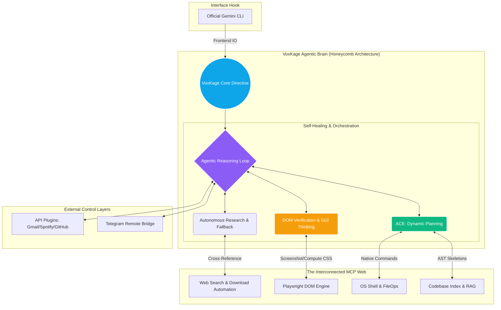

<div align="center">

  <p align="center">
    
  </p>

  <br>
  <h1>VoxKage</h1>
  <h3><i>The Living Agentic OS Framework</i></h3>
  <p><b>Utilizing the Gemini CLI interface to power an untethered, system-wide AI brain.</b></p>
  <br>

  <p align="center">
    <a href="https://pypi.org/project/voxkage/" target="_blank">
      
    </a>
    
    
    
  </p>

  <p align="center">
    
    
    
    
  </p>

  <br>
  <hr width="100%">
  <br>

  <p>
    <strong>VoxKage</strong> is a massive evolution beyond standard coding assistants. It is a <strong>living Agentic OS Framework</strong> designed to break the AI out of its IDE prison. By hijacking the Gemini CLI to use as its conversational frontend, VoxKage deploys a complex "honeycomb" of intertwined MCP capabilities to gain real-time, autonomous, and untethered access to the whole internet, your file system, and your operating system.
  </p>

  <p>
    [<a href="#innovation"><strong>View Architecture</strong></a>] •
    [<a href="#features"><strong>Explore Capabilities</strong></a>] •
    [<a href="#started"><strong>Get Started</strong></a>] •
    [<a href="#upgrade"><strong>Update / Upgrade</strong></a>]
  </p>
  <br>
  <hr width="100%">
  <br>
</div>

<a name="innovation"></a>
# 🧠 The Innovation:
## The Imprisonment Limitation:-
Modern AI CLIs (like Claude Code, Cursor, or the base Gemini CLI) are incredibly powerful text generators, but they suffer from a fundamental limitation: **Imprisonment**. They are strictly confined to the directory they are launched in.

If you ask a normal CLI assistant to *"Diagnose why my locally hosted web app isn't rendering properly, cross-reference the frontend CSS with the network tab, download the correct backend dependency from the official site, and install it"*, they fail. They don't have eyes, they can't orchestrate multi-domain research, and they can't interact with your operating system on a holistic level.

The Challenge: How do we transform a static text-generation tool into a proactive, self-healing, system-wide orchestrator without compromising security or relying on paid API credits?

<br>

## The "VoxKage" OS Evolution:-
VoxKage solves this by treating the official Gemini CLI merely as a "mouthpiece" for its own highly complex brain. VoxKage is **not a wrapper**—it is an independent entity that mounts 18 specialized Model Context Protocol (MCP) servers into the runtime state, creating an interwoven web of tools.

VoxKage doesn't just "plug and play" a web search tool. It utilizes its honeycomb architecture to combine tools autonomously: it spins up a Playwright browser, takes a screenshot of a broken webpage, extracts the DOM computed styles, uses semantic web search to find a solution, writes a step-by-step repair plan, and executes it via the native OS shell—all in one fluid, self-correcting thought loop.

<br>

## The Architectural Breakdown:-



VoxKage operates using a deeply interconnected web of capabilities. Here is how the brain actually works:

### ⚙️ 1. ACE Coding Engine & Autonomous Self-Correction
VoxKage forces a strict 5-phase developer pipeline (The Agentic Coding Engine). It does not guess.
- **RAG Awareness:** Indexes the codebase into a vector store before typing.
- **Planning:** Generates a persistent `active_plan.md` step-by-step checklist.
- **AST Skeletons:** Extracts 40-line structural metadata from 2000-line files, creating **95% token efficiency**.
- **Self-Healing Verification:** Runs compilation or DOM checks after editing. If a step fails, VoxKage automatically flags it as "failed", researches the error, fixes it, and updates the plan.

### 🌐 2. GUI Thinking & Deep Web Automation
VoxKage uses the entire internet as its playground. It spins up an invisible Playwright browser to:
- Take visual screenshots and perform OCR verification.
- Extract `computed CSS` to debug animations and layouts.
- Automatically navigate official software pages, find the correct `.exe` for your OS, verify it, and execute the installation.

### 🌉 3. The Omnipresent Bridges
You can walk away from your PC and text your VoxKage Telegram bot. Ask it: *"Hey, my CI/CD pipeline failed on GitHub. Find the error log, write a patch locally on my PC, test it, and push the fix."* VoxKage coordinates the Telegram API, GitHub API, local Git shell, and ACE engine to do it while you're grabbing coffee.

---

<a name="features"></a>
# ✨ Core Capabilities & Engineering Specs:-
<h2 align="center">📈 The VoxKage Advantage vs Industry Standards</h2>

<div align="center">
  <table width="95%">
    <thead>
      <tr style="background-color: #1e293b; color: white;">
        <th align="left">Metric</th>
        <th align="center">Standard AI IDEs (Cursor/Cline)</th>
        <th align="center">VoxKage Framework</th>
      </tr>
    </thead>
    <tbody>
      <tr>
        <td><b>Execution Scope</b></td>
        <td align="center">Imprisoned (Single Project)</td>
        <td align="center"></td>
      </tr>
      <tr>
        <td><b>Token Efficiency</b></td>
        <td align="center">Reads full files (High Burn Rate)</td>
        <td align="center"></td>
      </tr>
      <tr>
        <td><b>Operating Cost (OPEX)</b></td>
        <td align="center">$20/mo + API Usage Costs</td>
        <td align="center"></td>
      </tr>
      <tr>
        <td><b>Model Amplification</b></td>
        <td align="center">Depends on strictly paid models</td>
        <td align="center"></td>
      </tr>
      <tr>
        <td><b>Web & GUI Logic</b></td>
        <td align="center">Text Scraping / No Visuals</td>
        <td align="center"></td>
      </tr>
      <tr>
        <td><b>Remote Access</b></td>
        <td align="center">Requires physical PC access</td>
        <td align="center"></td>
      </tr>
      <tr>
        <td><b>Installation</b></td>
        <td align="center">Complex repo cloning + setup</td>
        <td align="center"></td>
      </tr>
    </tbody>
  </table>
</div>

<br>

> [!TIP]
> **Model Amplification:** Because VoxKage enforces structured "Agent Thinking Loops" and reduces context payloads using AST Skeletons, it allows free-tier models (like `gemini-3-flash-preview` or `gemini-2.5-flash-lite`) to execute tasks with the accuracy and reliability typically reserved for heavy, expensive Pro models.

---

<a name="started"></a>
# 🛠️ Getting Started: Install in 60 Seconds

VoxKage is a globally installable Python package. No cloning, no virtual environments, no setup scripts.

## Prerequisites

Before installing VoxKage, ensure the following are on your system:

| Requirement | Minimum Version | Check command |
|---|---|---|
| **Python** | 3.10+ | `python --version` |
| **pipx** | any | `pipx --version` |
| **Gemini CLI** | any | `gemini --version` |
| **Node.js** | 18+ | `node --version` |

**Install pipx if you don't have it:**
```bash
pip install pipx
pipx ensurepath
```

**Install Gemini CLI (the AI frontend VoxKage hijacks):**
```bash
npm install -g @google/gemini-cli
gemini   # Run once to authenticate with your Google account
```

---

## Step 1: Install VoxKage

```bash
pipx install voxkage
```

That's it. VoxKage is now globally available as the `voxkage` command from any directory on your machine. The core install is around ~80 MB and takes under a minute on a decent connection.

---

## Step 2: Run the Setup Wizard

```bash
voxkage init
```

The wizard will:
- Create your `~/.voxkage` data directory (stores memory, credentials, config)
- Scaffold your `.env` secrets file for Telegram, Spotify, GitHub, Gmail
- Inject the VoxKage personality directives into your Gemini CLI settings
- Register all 18 MCP servers into Gemini CLI's `settings.json`
- Prompt you to install optional capability packs

*Expected output:*
```text
  ┌────────────────────────────────────────────────────────────┐
  │  ✦  VoxKage v1.1.0 — First-Time Setup                      │
  │  ────────────────────────────────────────────────────────  │
  │  VoxKage supercharges your Gemini CLI into a living OS AI. │
  │  This takes about 2 minutes.                               │
  └────────────────────────────────────────────────────────────┘

  ✓  Platform: Windows
  ✓  Data directory: C:\Users\YourName\.voxkage
  ✓  MCP servers registered: 18
  ✓  Gemini CLI settings patched
```

---

## Step 3: Install Capability Packs (Optional but Recommended)

The core VoxKage is immediately powerful. Heavy ML packs are opt-in to keep the base install fast. Install them anytime using:

```bash
voxkage install <pack>
```

| Pack | What it unlocks | Size |
|---|---|---|
| `browser` | Playwright web automation, DOM inspection, screenshot analysis, PDF reading | ~80 MB pkg + ~150 MB Chromium |
| `rag` | ChromaDB semantic memory, full codebase indexing, document RAG | ~500 MB |
| `vision` | OpenCV + RapidOCR for screen reading and image analysis | ~250 MB |
| `docs_plus` | Word/PDF/Excel format conversion and document intelligence | ~80 MB |
| `full` | Everything above in one command | ~910 MB |

**Install the browser engine** (highly recommended — powers web search and automation):
```bash
voxkage install browser
```

**Install everything at once:**
```bash
voxkage install full
```

---

## Step 4: Configure Your Integrations

Edit your secrets file to connect VoxKage to external services:

```bash
# Open the secrets file (Windows)
notepad C:\Users\YourName\.voxkage\.env

# macOS / Linux
nano ~/.voxkage/.env
```

```env
# ── Telegram Remote Control ──────────────────────────
TELEGRAM_BOT_TOKEN=your_token_from_@BotFather
TELEGRAM_CHAT_ID=your_personal_chat_id

# ── Spotify Music Control ────────────────────────────
SPOTIFY_CLIENT_ID=your_client_id
SPOTIFY_CLIENT_SECRET=your_client_secret
SPOTIFY_REDIRECT_URI=http://localhost:8888/callback

# ── GitHub Integration ───────────────────────────────
GITHUB_PAT=your_personal_access_token

# ── Gmail (uses OAuth — run voxkage plugins add gmail)
# No token needed here — handled by OAuth flow
```

Check your connection status at any time:
```bash
voxkage status
```

```text
  SYSTEM HEALTH
    ✓  VoxKage Core       v1.1.0
    ✓  MCP Servers        18 registered

  CAPABILITY PACKS
    ✓  Core AI + OS Control       (always on)
    ✓  RAG Memory                 installed
    ✓  Vision & OCR               installed
    ✗  Browser Engine             voxkage install browser
    ✓  PDF Conversion             installed

  INTEGRATIONS
    ✓  Telegram           Connected
    ✗  Spotify            Add SPOTIFY_CLIENT_ID to .env
    ✓  GitHub             Connected
    ✓  Gmail              Connected
```

---

## Step 5: Wake Up VoxKage

```bash
voxkage
```

You are now inside a fully agentic OS session. VoxKage is running with all 18 MCP tools mounted and ready.

---

## Step 6 (Optional): System Tray + Telegram Remote Mode

Launch the persistent background daemon that puts VoxKage in your system tray and starts listening for Telegram messages:

```bash
voxkage tray
```

From this point, you can close the terminal. VoxKage is alive in the background. Text it from your phone via Telegram to command your PC remotely from anywhere in the world.

---

## Directory Structure

After initialization, VoxKage creates this layout:

```text
C:\Users\YourName\.voxkage\           # Core data directory
├── .gemini\
│   ├── GEMINI.md                     # VoxKage personality & tool awareness directives
│   └── settings.json                 # All 18 MCP server registrations
├── data\                             # Credentials, Gmail OAuth tokens
├── rag\                              # ChromaDB vector store (if RAG installed)
├── logs\                             # Session traces and health logs
├── .env                              # Your integration secrets
└── config.json                       # Model selection and agentic loop config
```

---

<a name="upgrade"></a>
# 🔄 Updating & Upgrading VoxKage

## Standard Upgrade (Recommended)

To update VoxKage to the latest release from PyPI:

```bash
pipx upgrade voxkage
```

Check your installed version vs the latest:
```bash
voxkage --version
pip index versions voxkage   # Lists all available versions
```

---

## If `pipx upgrade` Fails or Gets Stuck

This can happen if a previous VoxKage process (tray, watcher) is still running and has locked the Python executable. Follow this sequence:

**Step 1 — Kill any running VoxKage processes:**
```bash
# Windows PowerShell
Get-Process -Name "pythonw","python" -ErrorAction SilentlyContinue | `
  Where-Object { $_.Path -like "*pipx*voxkage*" } | `
  Stop-Process -Force
Start-Sleep -Seconds 2
```

**Step 2 — Force reinstall the latest version:**
```bash
pipx install voxkage --force
```

**Step 3 — If permission errors still appear (e.g., `[Errno 13] Permission denied`):**
```bash
# Remove the broken venv and reinstall cleanly
pipx uninstall voxkage
pipx install voxkage
```

**Step 4 — Verify the upgrade worked:**
```bash
voxkage --version
```

---

## Pinning to a Specific Version

If you need to test or rollback to a specific version:
```bash
pipx install voxkage==1.1.0 --force
```

---

## Upgrading Optional Packs After a VoxKage Upgrade

Optional capability packs (RAG, Vision, Browser) are injected into VoxKage's isolated `pipx` venv. After upgrading VoxKage itself, re-inject them if any are missing:

```bash
# Re-inject individual packs (using exact packages from pyproject.toml)
pipx inject voxkage playwright PyMuPDF             # browser
pipx inject voxkage chromadb sentence-transformers numpy pyarrow  # rag
pipx inject voxkage opencv-python rapidocr-onnxruntime            # vision
pipx inject voxkage docx2pdf pdf2docx              # docs_plus

# After injecting the browser pack, also install the Chromium binary:
pipx run --spec voxkage playwright install chromium
# Or simply:
voxkage install browser   # the CLI handles the playwright install chromium step automatically

# Or install all packs in one shot via the VoxKage CLI
voxkage install full
```

---

## Completely Uninstalling VoxKage

```bash
# Remove the package
pipx uninstall voxkage

# Optionally remove all stored data, memory, and configs
# Windows:
Remove-Item -Recurse -Force "$env:USERPROFILE\.voxkage"
# macOS / Linux:
rm -rf ~/.voxkage
```

---

# 🔌 Command Reference

| Command | Description |
|---|---|
| `voxkage` | Start a VoxKage agentic session |
| `voxkage init` | Run the first-time setup wizard (safe to re-run) |
| `voxkage status` | Check system health, pack status, and integration connections |
| `voxkage tray` | Launch the background system tray daemon + Telegram watcher |
| `voxkage install <pack>` | Install an optional capability pack (`rag`, `browser`, `vision`, `docs_plus`, `full`) |
| `voxkage plugins` | List all registered plugins and their connection state |
| `voxkage plugins add <name>` | Configure a plugin interactively (`telegram`, `spotify`, `github`, `gmail`) |
| `voxkage --version` | Print the installed version |
| `voxkage --help` | Show all available commands |

---

## 🗺️ Roadmap & Future Evolutions

- [x] **Shipped:** `pipx install voxkage` — single-command global installation
- [x] **Shipped:** Native tkinter Settings Dashboard (zero extra deps, instant-open from tray)
- [x] **Shipped:** Core-First lean install (~80 MB) with optional heavy packs
- [x] **Shipped:** Telegram Remote Control — command your OS from your phone
- [x] **Shipped:** `voxkage init` intelligence — detects already-installed packs, skips redundant prompts
- [ ] **In Progress:** Finalizing the `[project.entry-points."voxkage.plugins"]` API to allow the community to publish custom plugins (e.g., Jira, AWS, Docker orchestrators) via PyPI that VoxKage automatically detects and mounts into its honeycomb.
- [ ] **Planned:** macOS and Linux System Tray parity.
- [ ] **Planned:** VoxKage Cloud Sync — encrypted cross-device memory persistence.

---

## 🤝 Contributing

VoxKage is an open-source initiative designed to push the boundaries of local AI orchestration. If you want to contribute a new MCP server or refine the ACE logic:

1. Fork the repository.
2. Create your feature branch (`git checkout -b feature/AdvancedRAG`).
3. Commit your changes (`git commit -m 'Implement advanced semantic search'`).
4. Push to the branch (`git push origin feature/AdvancedRAG`).
5. Open a Pull Request.

---

<br>

<div align="center">
  <a href="https://www.linkedin.com/in/ayush-dwivedi29/">
    
  </a>
  <a href="mailto:ayushdwivedi2049@gmail.com">
    
  </a>

  <a href="https://github.com/ayushdwivedi001">
    
  </a>
  
  <a href="https://pypi.org/project/voxkage/">
    
  </a>
</div>

<br>
<hr width="100%">
<br>
<div align="center">
  <i>"I am ready, sir."</i><br>
  <b>— VoxKage</b>
</div>
