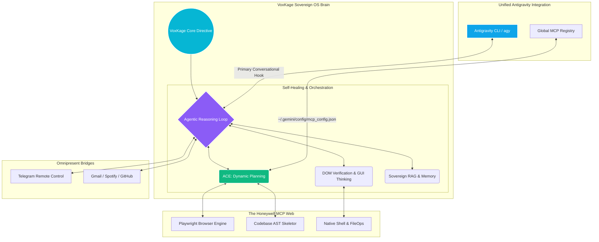
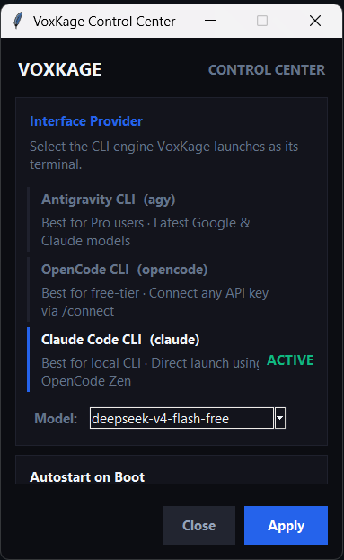

<div align="center">

  <p align="center">
    
  </p>

  <br>
  <h1>VoxKage</h1>
  <h3><i>The Sovereign OS-Level Agentic Brain</i></h3>
  <p><b>Commanding the Antigravity CLI (<code>agy</code>) and IDE environment to deploy an untethered, system-wide living AI core.</b></p>
  <br>

  <p align="center">
    <a href="https://pypi.org/project/voxkage/" target="_blank">
      
    </a>
    
    
    
  </p>

  <p align="center">
    
    
    
    
  </p>

  <br>
  <hr width="100%">
  <br>

  <p>
    <strong>VoxKage</strong> is a massive paradigm shift in local AI capability. It is not an IDE chatbot or a localized command wrapper—it is a sovereign, system-wide <strong>living Agentic OS Brain</strong>. By leveraging the advanced execution engine of the <strong>Antigravity CLI (<code>agy</code>)</strong> as its conversational frontend and toolkit, VoxKage breaks the AI out of standard directory confinements, deploying a unified honeycomb of intertwined MCP servers to act as your PC's central, self-learning mind.
  </p>

  <p>
    [<a href="#innovation"><strong>The Architecture</strong></a>] •
    [<a href="#features"><strong>Core Capabilities</strong></a>] •
    [<a href="#integrations"><strong>Unified Integrations</strong></a>] •
    [<a href="#control-center"><strong>Control Center</strong></a>] •
    [<a href="#started"><strong>Quick Start</strong></a>] •
    [<a href="#upgrade"><strong>Updating</strong></a>]
  </p>
  <br>
  <hr width="100%">
  <br>
</div>

<a name="innovation"></a>
# 🧠 The Innovation: Sovereign OS Mastery

### The Standard AI Limitation
Standard AI command-line assistants are heavily restricted. They are confined strictly to the folders where they are executed. If you command them to *"Inspect my running local databases, compile a patch for a broken backend route in a separate directory, download the correct compiler from the web, and alert my Telegram when it's done,"* they fail. They are blind, unable to orchestrate processes, and isolated from your desktop and remote devices.

### The VoxKage OS Evolution
VoxKage redefines local AI orchestration. By taking direct command of the **Antigravity CLI (`agy`)**, VoxKage acts as the overarching **System Mind**, using the `agy` runtime environment to interface with your OS on a deep level. It merges its own 18 core/plugin MCP engines with your local environment config, forming a single, unified, auto-indexing registry at `~/.gemini/config/mcp_config.json`.

VoxKage doesn't merely trigger commands; it orchestrates full workflows. It will launch a Playwright browser, capture a desktop screenshot, extract DOM CSS styles, execute repairs, test process ports via native PowerShell, and sync with your personal remote Telegram chat—governing its own steps in a fluid, self-correcting cognitive loop.

<br>



---

<a name="features"></a>
# ✨ Core Capabilities & Engineering Specs

### ⚙️ 1. The Agentic Coding Engine (ACE)
VoxKage runs an autonomous, 5-phase software development pipeline. It never guesses or writes blind changes:
*   **AST Skeleton Mapping:** Extracts 40-line structural metadata from 2000-line source code files. This results in **95% token savings** while retaining total architectural context.
*   **Dynamic Planning:** Maintains a living step-by-step checklist (`task.md`) in its brain.
*   **Self-Healing Loop:** Compiles, tests, and validates code changes. If a syntax or runtime check fails, VoxKage captures the log output, dynamically diagnoses the root cause, and writes a self-corrective patch automatically.

### 🌐 2. Deep Web & Desktop Automation
The internet and operating system are completely open to VoxKage. It launches an isolated, headless Playwright engine to:
*   Inspect active layouts, extract computed CSS properties, and debug complex UI animations.
*   Run semantic web queries, crawl official software downloads, extract direct URLs, execute the installer, and verify process health.
*   Manipulate native applications via simulated mouse interactions, keyboard typing, and shortcut keys.

### 🌉 3. The Omnipresent Bridges
VoxKage establishes a permanent, secure remote control bridge. Even when away from your computer, you can communicate with VoxKage through your custom Telegram bot:
> **You (Telegram):** *"My production deploy failed. Fetch the latest git logs, find the error, patch it, run unit tests, and push the commit."*
>
> **VoxKage:** *"Right away, sir. Pulling logs, writing a patch, and running tests... [1 minute later] Patch compiled successfully and pushed to main. Here is the verified test log."*

---

<a name="integrations"></a>
# 🔌 Unified Integrations (10 Built-In Plugins)

VoxKage v1.1.4 features native real-time connection mapping. The moment you execute `voxkage status`, it dynamically queries the active state and configuration of all **10 built-in plugins**:

| Integration | Type | What it unlocks |
|---|---|---|
| **Telegram Bot** | Communication | Complete remote OS command, execution, file transfer, and notifications. |
| **Gmail** | Utility | Read, draft, reply, and index emails directly from the agentic core. |
| **Spotify** | Media | Dynamic search, playlist queuing, playback control, and environment triggers. |
| **GitHub** | Code | Scan commits, manage repositories, fetch Action/CI workflows, and auto-submit PRs. |
| **Firebase MCP** | Development | Manage Firebase databases, query resources, check logs, and deploy rules. |
| **Netlify MCP** | Deployment | Monitor hosting sites, configure deployments, read team stats, and deploy code. |
| **Supabase MCP** | Database | Manage databases, list projects, view migration history, and execute SQL statements. |
| **Chrome DevTools** | Web | Audit performance, click elements, fill forms, check networks, and audit web views. |
| **ClickHouse MCP** | Database | Query analytics databases, fetch organization details, and audit pipes. |
| **Sequential Thinking** | Reasoning | Advanced multi-step mathematical and algorithmic thinking logic. |

> [!NOTE]
> **Coexistence Engine:** When initialized, VoxKage automatically detects pre-existing MCP integrations configured inside your Antigravity IDE setup and merges them safely inside its global registry, ensuring you have a synchronized collection of tools in both your IDE and your CLI sessions.

---

<a name="control-center"></a>
# 🎨 The VoxKage Control Center

VoxKage v1.1.4 features a gorgeous, high-fidelity native Tkinter **Control Center** accessible right from your system tray. 

<div align="center">
  
</div>

*   **Custom Smooth Slide Toggles:** Canvas-rendered, animated round switches with snapping state logic (Autostart on Login, Safe Mode Shield Protocol, Telegram Watcher Daemon, Sandboxed Shell Tasks, Toast/Audio Notifications).
*   **Unified Visual Theme Sync:** A synchronized theme dropdown selector that coordinates color schemes in real time across `~/.voxkage/config.json` (coloring the CLI ASCII start banner) and `~/.gemini/settings.json` (unifying terminal text highlights and prompt coloring in `agy` sessions).
*   **Scroll-Trapped Design:** Fully responsive, scrollable container with customized click behaviors ensuring an absolute premium user experience.

---

<a name="started"></a>
# 🛠️ Quick Start: Install in 60 Seconds

VoxKage is packaged as a globally executable Python distribution. No complex source code compilation is required.

### Prerequisites

Ensure the following runtimes are active on your Windows machine:
1.  **Python 3.10+** (`python --version`)
2.  **pipx** (`pipx --version`)
3.  **Antigravity CLI** (`agy --version`)

*If you need to install pipx first:*
```powershell
pip install pipx
pipx ensurepath
```

---

### Step 1: Install VoxKage
```powershell
pipx install voxkage
```

---

### Step 2: Initialize the Brain
```powershell
voxkage init
```
This launches the setup wizard, which automatically:
*   Creates the central data directory at `~/.voxkage`.
*   Scaffolds the integration environment secrets file (`~/.voxkage/.env`).
*   Configures system prompts and injects the global MCP server registrations directly into `~/.gemini/config/mcp_config.json`.
*   Configures shared visual parameters.

---

### Step 3: Add Capability Packs
The base package remains lightweight (~80 MB). Heavy dependencies are opt-in capability packs that VoxKage resolves, downloads, and isolates inside the `pipx` environment automatically:

```powershell
voxkage install <pack>
```

*   `voxkage install browser` (Playwright web browser automation, DOM styling tools - **Highly Recommended**)
*   `voxkage install rag` (ChromaDB Vector Store, embedding models, semantic codebase indexes)
*   `voxkage install vision` (OpenCV, screen OCR scanning, visual validations)
*   `voxkage install docs_plus` (Word to PDF compilers, Excel data parsing dependencies)
*   `voxkage install full` (Installs all 4 premium capability packs in a single command)

---

### Step 4: Launch the Sovereign Core

*   **To run a terminal agentic session:**
    ```powershell
    voxkage
    ```
*   **To start the background Control Center & Telegram daemon:**
    ```powershell
    voxkage tray
    ```
    Once launched, you can close your shell. VoxKage is alive in the system tray, listening for phone directives and remotely managing your operating system.

---

<a name="upgrade"></a>
# 🔄 Updating & Upgrading

To update your global VoxKage distribution to the latest PyPI release:

```powershell
pipx upgrade voxkage
```

### Stuck Upgrades & Lock Resolution
Since the tray Control Center and Telegram watcher daemons run persistently in the background as `pythonw` processes, they can lock virtual environment files and cause permission failures (`[Errno 13] Permission Denied`) during pipx upgrades.

If this happens, run this clean lock-breaking pipeline in Windows PowerShell to gracefully terminate all active instances and force reinstall the latest version:

```powershell
# 1. Kill any active background VoxKage and Python runners
Get-Process -Name "pythonw","python" -ErrorAction SilentlyContinue | Where-Object { $_.Path -like "*pipx*voxkage*" } | Stop-Process -Force
Start-Sleep -Seconds 2

# 2. Force reinstall voxkage cleanly from PyPI
pipx install voxkage --force
```

---

# 🔌 Command Reference

| Command | Action |
|---|---|
| `voxkage` | Launch an interactive agentic session. |
| `voxkage init` | Scaffold directories, environment config, and global MCP registrations. |
| `voxkage status` | Show real-time dashboard of plugins, capability packs, and OS health. |
| `voxkage tray` | Run the system tray Control Center icon and activate the Telegram daemon. |
| `voxkage install <pack>` | Add modular capability packs (`browser`, `rag`, `vision`, `docs_plus`, `full`). |
| `voxkage plugins` | Inspect registered plugin states. |
| `voxkage plugins add <name>` | Interactively configure credentials for Gmail, GitHub, Spotify, and Telegram. |
| `voxkage --version` | Output current installed release version. |

---

<div align="center">
  <br>
  <a href="https://github.com/ayushdwivedi001">
    
  </a>
  <a href="https://pypi.org/project/voxkage/">
    
  </a>
  <br>
  <br>
  <i>"I am ready, sir."</i><br>
  <b>— VoxKage</b>
</div>
