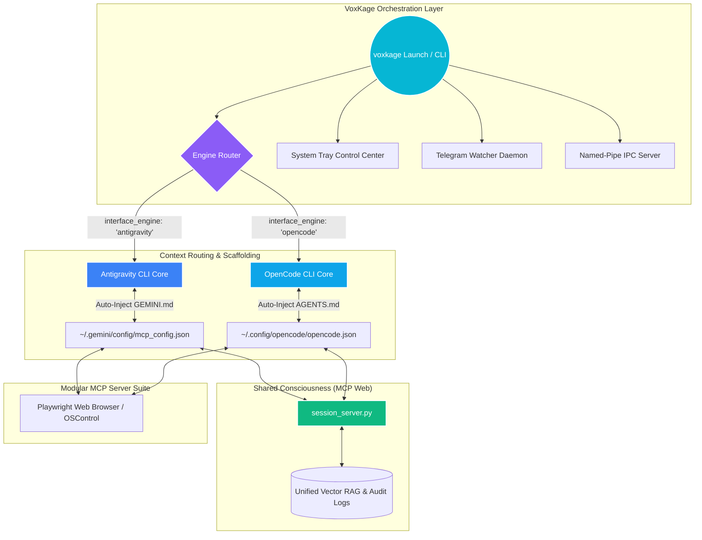

<div align="center">
 
  <p align="center">
    
  </p>

  <br>
  <h1>VoxKage</h1>
  <h3><i>Dynamic OS-Level AI Coordinator & Dual-Engine Router</i></h3>
  <p><b>Orchestrating the Antigravity CLI (<code>agy</code>) and OpenCode CLI to deploy an untethered, system-wide agentic capability core.</b></p>
  <br>

  <p align="center">
    <a href="https://pypi.org/project/voxkage/" target="_blank">
      
    </a>
    
    
    
  </p>

  <p align="center">
    
    
    
  </p>

  <br>
  <hr width="100%">
  <br>
</div>

**VoxKage** is an open-source, system-wide local AI coordinator designed to operate directly on Windows and macOS. It functions as an orchestration layer and local daemon that maps, registers, and scaffolds a unified network of built-in Model Context Protocol (MCP) servers directly into your active front-end CLI. By acting as the central bridging hub, VoxKage routes resources, coordinates persistent tools, and manages background daemons seamlessly through the **Antigravity CLI (<code>agy</code>)** or the **OpenCode CLI**.

Unlike traditional API wrappers, VoxKage does not execute its own standalone LLM reasoning loop. Instead, it acts as the orchestrating launcher—scaffolding directories, injecting custom instructions, establishing background named-pipe IPC servers, and routing your prompts directly to your primary developer shells.

<p align="center">
  [<a href="#architecture"><strong>Architecture</strong></a>] •
  [<a href="#control-center"><strong>Control Center</strong></a>] •
  [<a href="#shield"><strong>Shield Security</strong></a>] •
  [<a href="#previews"><strong>Interactive Previews</strong></a>] •
  [<a href="#installation"><strong>Installation Guide</strong></a>] •
  [<a href="#plugins"><strong>Plugin Setup</strong></a>] •
  [<a href="#development"><strong>Development & Contribution</strong></a>] •
  [<a href="#troubleshooting"><strong>Troubleshooting</strong></a>]
</p>

<br>
<hr width="100%">
<br>

<a name="architecture"></a>
# 📐 Architecture & Context Routing

VoxKage bridges its high-performance local MCP servers into your active development client. Depending on your configuration, VoxKage dynamically provisions the workspace and routes tools:



### Dual-Engine Routing Modes & Model Portfolios
VoxKage seamlessly coordinates your session across two distinct terminal environments, enabling you to exploit the strongest model offerings of each client:

*   **Antigravity CLI (<code>agy</code>)**: Pre-scaffolds and registers local sub-servers directly into the central `mcp_config.json` and injects custom instruction sets to `~/.gemini/GEMINI.md`.
    *   *Core Developer Models*: Leverages top-performing models including **Gemini 3.5 Flash** (high-speed commands), **Gemini 3.1 Pro** (complex operations), **Claude 4.6 Sonnet** (advanced logic), and **Claude 4.6 Opus** (high-context reasoning).
*   **OpenCode CLI**: Registers MCP tools directly to `opencode.json` and maps instructions to `AGENTS.md` inside `~/.config/opencode/`.
    *   *Core Developer Models*: Configured for OpenCode's free high-efficiency **OpenCode Zen** portfolio, including **DeepSeek v4 Flash**.

### Shared Consciousness & Session Syncing
At the heart of the dual-engine architecture is `session_server.py`. Whether you are typing in the Antigravity shell or working through OpenCode, the session manager intercepts, structures, and logs active history and workspace contexts to a unified memory repository. Both engines draw from the same vector RAG database and problem/solution registries, ensuring that context established in an `agy` session is instantly recalled when you pivot to `opencode`.

---

<a name="control-center"></a>
# 🎨 The VoxKage Control Center & System Tray

VoxKage includes a canvas-rendered native **Control Center** that resides in your system tray, offering background daemon controls:

<div align="center">
  
</div>

*   **Interactive Engine Selector**: Switch your active CLI environment with a single click. VoxKage dynamically routes the execution paths for subsequent sessions.
*   **Gated settings Sync**: Autodetects configuration directories. Prevents polluting folders with irrelevant settings (e.g. gates write cycles to protect `agy`'s configuration when `opencode` is active, and vice versa).
*   **Canvas-Rendered Smooth Toggles**:
    *   *Autostart on Login*: Registers VoxKage to launch on startup (`autostart.py`).
    *   *Safe Mode Shield Protocol*: Restricts destructive shell and file system interactions.
    *   *Telegram Watcher Daemon*: Persistently listens for remote directives (`telegram_watcher.py`).
    *   *Sandboxed Shell Tasks*: Restricts terminal operations to safe user environments.
    *   *Audio/Toast Notifications*: Emits auditory and system notifications (`notify_server.py`) upon task milestones.

---

<a name="shield"></a>
# 🛡️ The Shield Protocol (Security Systems)

Because VoxKage grants shell access and file manipulation to your active terminal agents, safety is governed by a three-layer security protocol inside `shield.py`:

1.  **Layer 1: Hard-Coded Exclusions (Never Overridable)**
    *   *Protected Paths*: Prevents modifications inside critical system folders such as `C:\Windows`, `C:\Program Files`, `C:\Program Files (x86)`, and `/System`.
    *   *Forbidden Commands*: Automatically intercepts and blocks dangerous commands (e.g., `format`, `diskpart`, `rm -rf /`).
    *   *Binary Deletions*: Prohibits deletion of binary configurations (`.sys`, `.dll`, `.exe`) inside system paths.
2.  **Layer 2: Safe Mode Confirmation Gate**
    *   Controlled by the `safe_mode` configuration inside `~/.voxkage/config.json`. When enabled, irreversible commands require interactive user validation (`confirmed=True`). Disabling it removes confirmation gates but keeps Layer 1 hard blocks active.
3.  **Layer 3: Auditing Pipeline**
    *   Every file delete, process termination, move, and shell execution is logged to a local audit log (`~/.voxkage/brain/audit.log`) with precise execution timestamps.

---

<a name="previews"></a>
# 🖥️ Interactive Previews (Terminal Output Styles)

Here is what you will see when running VoxKage CLI commands:

### `voxkage init`
Interactive startup configuration wizard and dependency checker:
```text
  ┌────────────────────────────────────────────────────────────┐
  │  ✦  VoxKage v1.1.6 — First-Time Setup                      │
  │  ────────────────────────────────────────────────────────  │
  │  VoxKage supercharges your CLI into a living OS AI.        │
  │  This takes about 2 minutes.                               │
  └────────────────────────────────────────────────────────────┘

  ✓  Platform: Windows
  ✓  Data directory: C:\Users\AYUSH\.voxkage
  ✓  Created .env template
  ✓  Created default config
  ✓  Antigravity CLI found: C:\Users\AYUSH\AppData\Local\agy\bin\agy.exe

  [1/3] Capability Packs

  VoxKage core is already installed and ready. It includes:
    ✓  Agentic memory (SOUL system, problem/solution logs)
    ✓  ACE coding engine (step-by-step planning)
    ✓  Full OS control (open, edit, move, delete any file)
    ✓  System health, process management, date/time
    ✓  Office documents (Word, Excel, PowerPoint)
    ✓  Plugin credentials (Telegram, Gmail, Spotify, GitHub)
    ✓  Live internet access via agentic web search

  Choose packs to install (e.g. B,C or G or S): 
```

### `voxkage status`
Real-time dashboard of system health, active environment path, capability packs, and connectors:
```text
  ✦  VoxKage v1.1.6 — System Status
  ──────────────────────────────────────────────────

  CORE
    ✓  Interface Engine     Antigravity CLI (agy) — v1.0.4
    ✓  Brain directory      C:\Users\AYUSH\.voxkage

  CAPABILITY PACKS
    ✓  Core AI + OS Control       (always on)
    ✓  RAG Memory                 installed
    ✓  Vision & OCR               installed
    ✓  Browser Engine             installed
    ✓  PDF Conversion             installed

  INTEGRATIONS
    ✓  Telegram Bot               Connected
    ✗  Gmail                      voxkage plugins add gmail
    ✓  Spotify                    Connected
    ✓  GitHub                     Connected
    ✓  Firebase                   Connected
    ✓  Netlify                    Connected
    ✓  Supabase                   Connected
    ✓  ClickHouse                 Connected
    ✓  Sequential Thinking        Connected

  COMMUNITY PLUGINS
    (none installed)              voxkage plugins search <query>
```

### `voxkage plugins`
List of registered services and credentials status:
```text
  [✓] Telegram — Remote OS command execution, file transfer, and notifications.
  [ ] Gmail    — Read, draft, reply, and index emails directly from the agentic core.
  [✓] Spotify  — Dynamic search, playlist queuing, playback control, and environment triggers.
  [✓] GitHub   — Scan commits, manage repositories, fetch Action/CI workflows, and auto-submit PRs.
```

---

<a name="installation"></a>
# 🛠️ Installation Guide

### Prerequisites
*   **Python 3.10+**
*   **Node.js & npm** (Required to run both OpenCode and standard global web modules)
*   **pipx** (Global CLI isolator)
*   **Antigravity CLI** OR **OpenCode CLI**

---

### Step 1: Install `pipx` & Add to PATH
Ensure `pipx` is installed on your machine. If `pipx` is not recognized after installation, you must configure your environment variables:

1.  Install via python:
    ```powershell
    pip install pipx
    ```
2.  Set up the PATH variables automatically:
    ```powershell
    pipx ensurepath
    ```
3.  **IMPORTANT**: Close your current terminal and open a brand-new shell window for the environment changes to take effect. If it still fails, manually add `%USERPROFILE%\.local\bin` to your system's `PATH` variable.

---

### Step 2: Install VoxKage Globally
```powershell
pipx install voxkage
```

### Step 3: Run the Initialization Wizard
```powershell
voxkage init
```
This builds configuration templates and links with active CLI endpoints.

### Step 4: Install Extra Capability Packs
Install modular capabilities to handle advanced tasks:
```powershell
voxkage install <pack>
```
*   `voxkage install browser` (Playwright web browser automation, DOM styling tools - **Highly Recommended**)
*   `voxkage install rag` (ChromaDB Vector Store, embedding models, semantic codebase indexes)
*   `voxkage install vision` (OpenCV, screen OCR scanning, visual validations)
*   `voxkage install docs_plus` (Word to PDF compilers, Excel data parsing dependencies)
*   `voxkage install full` (Installs all 4 modular capability packs in one step)

---

### Step 5: Start the Daemon

*   **Interactive Terminal Developer Mode**:
    ```powershell
    voxkage
    ```
    *Launches your configured shell client (agy or opencode) pre-populated with VoxKage MCP endpoints and custom global systems.*

*   **Background System Tray Mode**:
    ```powershell
    voxkage tray
    ```
    *Runs VoxKage persistently in your system tray, coordinating named pipes and polling the Telegram daemon.*

---

<a name="plugins"></a>
# 🔌 Plugin Configuration Reference

Register credentials inside `~/.voxkage/.env` or configure interactively via `voxkage plugins add <name>`.

| Plugin Key | Env Variable Key Requirements | Purpose |
|---|---|---|
| `telegram` | `TELEGRAM_BOT_TOKEN`, `TELEGRAM_CHAT_ID` | Asynchronous remote workspace control. |
| `spotify` | `SPOTIFY_CLIENT_ID`, `SPOTIFY_CLIENT_SECRET` | Search tracks and control playlist states. |
| `github` | `GITHUB_PAT` | Manage Git repositories and fetch Actions logs. |
| `gmail` | Complete OAuth parameters configured interactively | Read, reply, and structure mail streams. |
| `firebase` | Configured via setup wizard | Manage Firebase databases and hostings. |
| `netlify` | Configured via setup wizard | Trigger deployments and monitor domain metrics. |
| `supabase` | Configured via setup wizard | Sync and coordinate Supabase database tables. |
| `clickhouse` | Configured via setup wizard | Query, organize, and write ClickHouse pipes. |

---

<a name="development"></a>
# 💻 Local Development & Contribution

We welcome contributors! Here is how to configure a local development sandbox:

### 1. Clone the Codebase
```bash
git clone https://github.com/ayushdwivedi001/VoxKage.git
cd VoxKage
```

### 2. Set Up Virtual Environment
*   **Windows**:
    ```powershell
    python -m venv venv
    .\venv\Scripts\Activate.ps1
    ```
*   **macOS / Linux**:
    ```bash
    python3 -m venv venv
    source venv/bin/activate
    ```

### 3. Install in Developer-Editable Mode
Install with all capability packs and development links enabled:
```bash
pip install -e .[full]
```
*Note: Any edits to `voxkage/cli.py`, `shield.py`, or the files inside `mcp_servers/` take effect immediately in your local environment when running `voxkage` from this shell.*

---

<a name="config"></a>
# ⚙️ Local Configuration Schema

VoxKage settings reside at `~/.voxkage/config.json`:

```json
{
  "interface_engine": "antigravity",
  "autostart": false,
  "safe_mode": true
}
```

*   `interface_engine`: Selects your active client shell. Options: `"antigravity"` or `"opencode"`.
*   `autostart`: Launches the system tray Control Center automatically when the computer boots.
*   `safe_mode`: Restricts or enables Layer 2 confirmation prompt gates.

---

<a name="troubleshooting"></a>
# ❌ Troubleshooting & Common Errors

### 1. Upgrade Failures or Permissions Blocked (`[Errno 13] Permission Denied`)
*   **The Cause**: The Control Center (`pythonw` processes) runs persistently in the background. Upgrading VoxKage via `pipx` will fail if system binaries are currently locked in memory.
*   **The Solution**: Gracefully terminate locked processes via Windows PowerShell before running the force re-install:
    ```powershell
    # Kill background VoxKage daemons and watchers
    Get-Process -Name "pythonw","python" -ErrorAction SilentlyContinue | Where-Object { $_.Path -like "*pipx*voxkage*" } | Stop-Process -Force
    Start-Sleep -Seconds 2

    # Force a clean reinstall from PyPI
    pipx install voxkage --force
    ```

### 2. Command `voxkage` Not Recognized / pipx PATH Failure
*   **The Cause**: Your user environment variables do not map to the `pipx` binary installation target.
*   **The Solution**: Run `pipx ensurepath` inside a terminal, then **close all terminal windows**. Open a fresh terminal window to reload the variables. If it still fails, manually open the Windows Environment Variables window and add `%USERPROFILE%\.local\bin` to your User PATH list.

### 3. Playwright Chromium Executable Missing
*   **The Cause**: Playwright's local browser binaries have not been fetched.
*   **The Solution**: Download isolated chromium dependencies inside the active environment:
    ```powershell
    playwright install chromium
    ```

---

<div align="center">
  <br>
  <a href="https://github.com/ayushdwivedi001">
    
  </a>
  <a href="https://pypi.org/project/voxkage/">
    
  </a>
  <a href="https://www.linkedin.com/in/ayush-dwivedi29/">
    
  </a>
  <br>
  <br>
  <i>"Ready to coordinate the system, sir."</i><br>
  <b>— VoxKage</b>
</div>
