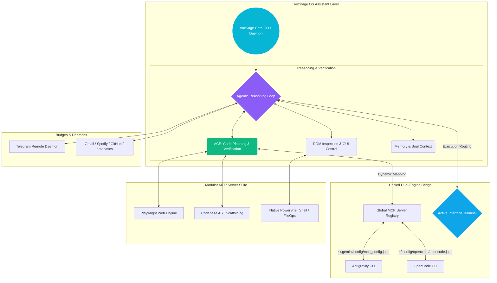

<div align="center">
 
  <p align="center">
    
  </p>

  <br>
  <h1>VoxKage</h1>
  <h3><i>System-Wide Agentic OS Assistant & Dual-Engine Router</i></h3>
  <p><b>Commanding the Antigravity CLI (<code>agy</code>) and OpenCode CLI to deploy a secure, system-wide local AI coordinator.</b></p>
  <br>

  <p align="center">
    <a href="https://pypi.org/project/voxkage/" target="_blank">
      
    </a>
    
    
    
  </p>

  <p align="center">
    
    
    
  </p>

  <br>
  <hr width="100%">
  <br>
</div>

**VoxKage** is an open-source, system-wide local AI coordinator designed to operate directly on Windows and macOS. Acting as a central bridging hub, it connects local runtimes, browser automation instances, and remote daemons directly to your system's shell. By routing tools through either the **Antigravity CLI (<code>agy</code>)** or the **OpenCode CLI**, VoxKage coordinates automated workflows, executes code updates, and communicates asynchronously through local and remote Model Context Protocol (MCP) integrations.

<p align="center">
  [<a href="#architecture"><strong>Architecture</strong></a>] •
  [<a href="#capabilities"><strong>Capabilities</strong></a>] •
  [<a href="#shield"><strong>Shield Security</strong></a>] •
  [<a href="#installation"><strong>Installation Guide</strong></a>] •
  [<a href="#plugins"><strong>Plugin Setup</strong></a>] •
  [<a href="#development"><strong>Development & Contribution</strong></a>] •
  [<a href="#troubleshooting"><strong>Troubleshooting</strong></a>]
</p>

<br>
<hr width="100%">
<br>

<a name="architecture"></a>
# 📐 Architecture & Context Routing

VoxKage functions as an MCP server registry provider and routing gateway. It coordinates system resources by dynamically mapping and deploying its modular array of built-in engines depending on which front-end CLI environment is active.



### Context Routing Modes
*   **Antigravity CLI (`agy`)**: High-performance execution. VoxKage configures `mcp_config.json` inside `~/.gemini/config/`, registering local sub-servers directly to provide unified IDE-and-CLI tool parity.
*   **OpenCode CLI**: Flexible terminal orchestration. VoxKage maps tool configurations to `opencode.json` inside `~/.config/opencode/`, allowing developers to integrate their custom API gateways and runtimes seamlessly.

---

<a name="capabilities"></a>
# ✨ Core Capabilities

### 1. Agentic Coding Engine (ACE)
VoxKage runs an autonomous development process that prevents blind source code modifications:
*   **AST Skeleton Scaffolding**: Leverages an Abstract Syntax Tree (AST) mapper to extract structural metadata from source files, preserving critical context while reducing token usage by up to **95%**.
*   **Self-Healing Compilations**: Tracks changes within a living, stateful task list (`task.md`). If a syntax check, compiler command, or unit test fails, the agent intercepts the exit logs, diagnoses the error, and automatically writes a self-corrective patch.

### 2. Deep Web & Desktop Automation
The system launches isolated Playwright instances to crawl the web, interact with local DOM structures, and retrieve information:
*   **Layout & Styling Auditing**: Inspects active layouts, pulls calculated CSS variables, and evaluates custom JavaScript.
*   **Software Execution**: Can search public pages for software binaries, resolve direct URLs, trigger installers locally, and verify execution ports.
*   **GUI Navigation**: Manipulates system UI components via keyboard events, shortcut actions, and mouse movements.

### 3. Permanently Bound Remote Controls
By setting up a background daemon, developers can query their workspace remotely through a secure, two-way Telegram bot bridge:
> **Developer (Telegram):** `/run git log -n 5`
>
> **VoxKage:** *Pulls the requested commits, compiles a summary report, and returns it to your mobile client.*

---

<a name="shield"></a>
# 🛡️ The Shield Protocol (Security & Sandboxing)

Operating an agent with direct access to system-level commands requires strict security guarantees. VoxKage includes `shield.py`, a three-layer security protocol designed to prevent destructive actions:

```
┌────────────────────────────────────────────────────────┐
│                   THE SHIELD PROTOCOL                  │
├────────────────────────────────────────────────────────┤
│ Layer 1: Core System Exclusions (Hard-coded)           │
│   - Protected Paths: C:\Windows, C:\Program Files, etc. │
│   - Dangerous Commands: diskpart, format, rm -rf /     │
├────────────────────────────────────────────────────────┤
│ Layer 2: Safe Mode Gate (Configurable Prompting)       │
│   - Intercepts and requires verification on operations │
├────────────────────────────────────────────────────────┤
│ Layer 3: Auditing Pipeline                             │
│   - Logs all shell & file interactions to audit.log    │
└────────────────────────────────────────────────────────┘
```

1.  **Layer 1: Hard-Coded Exclusions (Never Overridable)**
    *   **Paths**: Refuses modifications inside critical directories such as `C:\Windows`, `C:\Program Files`, `C:\Program Files (x86)`, and `/System`.
    *   **Commands**: Automatically blocks dangerous execution signatures (e.g., `format`, `diskpart`, `rm -rf /`).
    *   **Deletions**: Prohibits deletion of binary configurations (`.sys`, `.dll`, `.exe`) located inside system paths.
2.  **Layer 2: Safe Mode Gate (Configurable)**
    *   Checks `~/.voxkage/config.json` or the environmental `VOXKAGE_SAFE_MODE` parameter. Defaults to true to enforce manual CLI confirmation boundaries. Can be toggled if sandbox safety parameters are satisfied.
3.  **Layer 3: Auditing Pipeline**
    *   Every single destructive action (deletes, moves, terminations, shell executions) is logged to the local audit file (`~/.voxkage/brain/audit.log`) with an explicit timestamp and clearance state.

---

<a name="installation"></a>
# 🛠️ Installation Guide

VoxKage is distributed as a globally isolated Python CLI package using `pipx` to prevent dependency conflicts with your system environment.

### Runtimes Required
*   **Python 3.10 or higher**
*   **pipx** (Highly recommended for direct global command-line availability)
*   **Antigravity CLI** OR **OpenCode CLI**

*If you need to install pipx first:*
```powershell
pip install pipx
pipx ensurepath
```

---

### Step 1: Install VoxKage Globally
```powershell
pipx install voxkage
```

### Step 2: Initialize the System Configuration
```powershell
voxkage init
```
This triggers an interactive configuration script that:
*   Builds the runtime directories at `~/.voxkage`.
*   Scaffolds the environment parameters file (`~/.voxkage/.env`).
*   Auto-detects active instances of Antigravity or OpenCode and registers VoxKage's MCP configurations directly to their respective storage files.

### Step 3: Add Modular Capability Packs
To keep the base distribution lightweight (~80 MB), heavier dependencies are separated into on-demand packs installed directly inside the isolated environment:

```powershell
voxkage install <pack>
```

| Package Name | Key | System Runtimes Added | Estimated Size |
|---|---|---|---|
| **Web Browser** | `browser` | Playwright engine, browser drivers, and PDF readers | ~80 MB (+150MB browser binary) |
| **Vector Memory** | `rag` | Sentence-transformers, ChromaDB Vector DB, and Numpy | ~500 MB (includes ML runtime) |
| **Vision & Scan** | `vision` | OpenCV image processing engine and ONNX OCR runtimes | ~250 MB |
| **Office Docs Plus** | `docs_plus`| Bi-directional PDF/Docx conversion layers | ~80 MB |
| **Full Suite** | `full` | Installs all 4 capability packs at once | ~910 MB |

---

### Step 4: Run the Assistant

*   **Interactive Terminal Session**:
    ```powershell
    voxkage
    ```
    This initializes the interactive shell, presenting a unified dashboard and setting up the chosen routing engine (Antigravity/OpenCode).

*   **Background Tray Daemon & Telegram Listener**:
    ```powershell
    voxkage tray
    ```
    Runs the assistant persistently in the system tray, listening for external Telegram instructions without cluttering your open terminals.

---

<a name="plugins"></a>
# 🔌 Plugin Configuration Reference

VoxKage includes 10 built-in integrations. All plugins degrade gracefully if their configurations or environment keys are omitted. Add credentials to your environment variables file (`~/.voxkage/.env`) or configure them interactively:

```powershell
voxkage plugins add <name>
```

| Integration Name | Key | Environment Variable Key Requirements | Purpose |
|---|---|---|---|
| **Telegram Bot** | `telegram` | `TELEGRAM_BOT_TOKEN`, `TELEGRAM_CHAT_ID` | Asynchronous remote terminal orchestration. |
| **Gmail** | `gmail` | Complete OAuth credentials configured via setup wizard | Read, write, and index system emails. |
| **Spotify** | `spotify` | `SPOTIFY_CLIENT_ID`, `SPOTIFY_CLIENT_SECRET` | Voice-to-media triggers and playlist queuing. |
| **GitHub** | `github` | `GITHUB_PAT` | Repo cloning, commit logs, PR automation. |
| **Firebase** | `firebase` | Configured through the setup wizard | Query databases, deploy hosting/rules. |
| **Netlify** | `netlify` | Configured through the setup wizard | Deploy files, audit domains, review builds. |
| **Supabase** | `supabase` | Configured through the setup wizard | Manage database schema & migrations. |
| **Chrome DevTools** | `browser` | Installs via `voxkage install browser` | Layout testing, CSS extraction, JS executions. |
| **ClickHouse** | `clickhouse`| Configured through the setup wizard | Audit pipelines and write database queries. |
| **Sequential Thinking**| `reasoning` | Runs natively without configurations | Advanced multi-step math/algo planning. |

---

<a name="development"></a>
# 💻 Local Development & Contribution

If you want to modify VoxKage, build new capability packs, or inspect its core servers, you can set it up in editable developer mode:

### 1. Clone and Configure Runtimes
```bash
git clone https://github.com/ayushdwivedi001/VoxKage.git
cd VoxKage
python -m venv venv
```

### 2. Activate the Environment
*   **Windows**:
    ```powershell
    .\venv\Scripts\Activate.ps1
    ```
*   **macOS / Linux**:
    ```bash
    source venv/bin/activate
    ```

### 3. Install in Editable Mode with Dev Packages
```bash
pip install -e .[full]
```
Using `-e` mounts the project directory as a living module. Any edits to `cli.py`, `shield.py`, or inside the `mcp_servers` folders take effect immediately when calling `voxkage`.

---

<a name="config"></a>
# ⚙️ Local Configuration Schema

VoxKage's global options are saved within `~/.voxkage/config.json`. You can modify the configuration directly using a standard text editor:

```json
{
  "main_model": "gemini-2.5-flash",
  "subagent_model": "gemini-2.5-flash",
  "autostart": false,
  "safe_mode": true
}
```

*   `main_model`: The baseline LLM used for standard chat sessions and execution orchestration.
*   `subagent_model`: The secondary model assigned to execute narrow tasks in parallel sub-agents.
*   `autostart`: If set to `true`, launches the system tray daemon automatically upon user login.
*   `safe_mode`: Enables or disables Layer 2 safety gates across shell and file system operations.

---

<a name="troubleshooting"></a>
# ❌ Common Installation Errors & Troubleshooting

### 1. File Locks / Upgrades Denied (`[Errno 13] Permission Denied`)
Because the system tray and Telegram monitoring daemons run persistently in the background as `pythonw` runners, updating VoxKage via PyPI or running local developer setups can fail due to locked binaries inside virtual environments.

**Resolution**: Terminate active runners cleanly inside a Windows PowerShell terminal before attempting upgrades:
```powershell
# 1. Kill active background Pythonw / VoxKage processes
Get-Process -Name "pythonw","python" -ErrorAction SilentlyContinue | Where-Object { $_.Path -like "*pipx*voxkage*" } | Stop-Process -Force
Start-Sleep -Seconds 2

# 2. Force install/upgrade cleanly
pipx install voxkage --force
```

### 2. Missing Playwright Chromium Binaries
If you installed the `browser` capability pack but browser actions fail with errors stating that the browser is not found:

**Resolution**: Download the isolated browser runtimes to the local Playwright folder:
```powershell
playwright install chromium
```

### 3. System PATH Not Set Up for pipx
If running `voxkage` in your terminal returns `Command Not Found`:

**Resolution**: Run `pipx ensurepath` to append your user path to the system variables, and restart your shell.

---

<div align="center">
  <br>
  <a href="https://github.com/ayushdwivedi001">
    
  </a>
  <a href="https://pypi.org/project/voxkage/">
    
  </a>
  <a href="https://www.linkedin.com/in/ayush-dwivedi29/">
    
  </a>
  <br>
  <br>
  <i>"Ready to coordinate the system, sir."</i><br>
  <b>— VoxKage</b>
</div>
