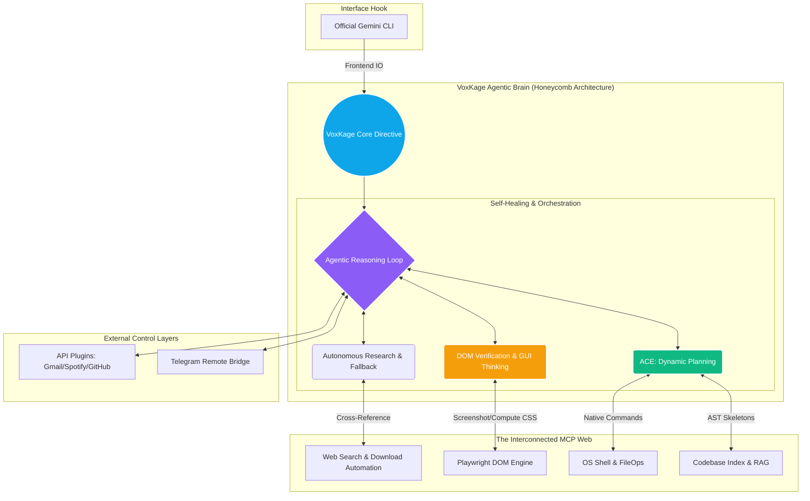

<div align="center">

  <p align="center">
    
  </p>

  <br>
  <h1>VoxKage</h1>
  <h3><i>The Living Agentic OS Framework</i></h3>
  <p><b>Utilizing the Gemini CLI interface to power an untethered, system-wide AI brain.</b></p>
  <br>

  <p align="center">
    <a href="https://github.com/ayushdwivedi001/VoxKage">
      
    </a>
    
    
    
  </p>

  <p align="center">
    
    
    
  </p>

  <br>
  <hr width="100%">
  <br>

  <p>
    <strong>VoxKage</strong> is a massive evolution beyond standard coding assistants. It is a <strong>living Agentic OS Framework</strong> designed to break the AI out of its IDE prison. By hijacking the Gemini CLI to use as its conversational frontend, VoxKage deploys a complex "honeycomb" of intertwined MCP capabilities to gain real-time, autonomous, and untethered access to the whole internet, your file system, and your operating system.
  </p>

  <p>
    [<a href="#features"><strong>Explore Capabilities</strong></a>] • 
    [<a href="#innovation"><strong>View Architecture</strong></a>] • 
    [<a href="#started"><strong>Get Started</strong></a>]
  </p>
  <br>
  <hr width="100%">
  <br>
</div>

<a name="innovation"></a>
# 🧠 The Innovation:
## The Imprisonment Limitation:-
Modern AI CLIs (like Claude Code, Cursor, or the base Gemini CLI) are incredibly powerful text generators, but they suffer from a fundamental limitation: **Imprisonment**. They are strictly confined to the directory they are launched in. 

If you ask a normal CLI assistant to *"Diagnose why my locally hosted web app isn't rendering properly, cross-reference the frontend CSS with the network tab, download the correct backend dependency from the official site, and install it"*, they fail. They don't have eyes, they can't orchestrate multi-domain research, and they can't interact with your operating system on a holistic level.

The Challenge: How do we transform a static text-generation tool into a proactive, self-healing, system-wide orchestrator without compromising security or relying on paid API credits?

<br>

## The "VoxKage" OS Evolution:-
VoxKage solves this by treating the official Gemini CLI merely as a "mouthpiece" for its own highly complex brain. VoxKage is **not a wrapper**—it is an independent entity that mounts 18 specialized Model Context Protocol (MCP) servers into the runtime state, creating an interwoven web of tools. 

VoxKage doesn't just "plug and play" a web search tool. It utilizes its honeycomb architecture to combine tools autonomously: it spins up a Playwright browser, takes a screenshot of a broken webpage, extracts the DOM computed styles, uses semantic web search to find a solution, writes a step-by-step repair plan, and executes it via the native OS shell—all in one fluid, self-correcting thought loop.

<br>

## The Architectural Breakdown:-



VoxKage operates using a deeply interconnected web of capabilities. Here is how the brain actually works:

### ⚙️ 1. ACE Coding Engine & Autonomous Self-Correction
VoxKage forces a strict 5-phase developer pipeline (The Agentic Coding Engine). It does not guess.
- **RAG Awareness:** Indexes the codebase into a vector store before typing.
- **Planning:** Generates a persistent `active_plan.md` step-by-step checklist.
- **AST Skeletons:** Extracts 40-line structural metadata from 2000-line files, creating **95% token efficiency**.
- **Self-Healing Verification:** Runs compilation or DOM checks after editing. If a step fails, VoxKage automatically flags it as "failed", researches the error, fixes it, and updates the plan.

### 🌐 2. GUI Thinking & Deep Web Automation
VoxKage uses the entire internet as its playground. It spins up an invisible Playwright browser to:
- Take visual screenshots and perform OCR verification.
- Extract `computed CSS` to debug animations and layouts.
- Automatically navigate official software pages, find the correct `.exe` or `.dmg` for your specific OS, verify it, and execute the installation.

### 🌉 3. The Omnipresent Bridges
You can walk away from your PC and text your VoxKage Telegram bot. Ask it: *"Hey, my CI/CD pipeline failed on GitHub. Find the error log, write a patch locally on my PC, test it, and push the fix."* VoxKage coordinates the Telegram API, GitHub API, local Git shell, and ACE engine to do it while you're grabbing coffee.

---

<a name="features"></a>
# ✨ Core Capabilities & Engineering Specs:-
<h2 align="center">📈 The VoxKage Advantage vs Industry Standards</h2>

<div align="center">
  <table width="95%">
    <thead>
      <tr style="background-color: #1e293b; color: white;">
        <th align="left">Metric</th>
        <th align="center">Standard AI IDEs (Cursor/Cline)</th>
        <th align="center">VoxKage Framework</th>
      </tr>
    </thead>
    <tbody>
      <tr>
        <td><b>Execution Scope</b></td>
        <td align="center">Imprisoned (Single Project)</td>
        <td align="center"></td>
      </tr>
      <tr>
        <td><b>Token Efficiency</b></td>
        <td align="center">Reads full files (High Burn Rate)</td>
        <td align="center"></td>
      </tr>
      <tr>
        <td><b>Operating Cost (OPEX)</b></td>
        <td align="center">$20/mo + API Usage Costs</td>
        <td align="center"></td>
      </tr>
      <tr>
        <td><b>Model Amplification</b></td>
        <td align="center">Depends on strictly paid models</td>
        <td align="center"></td>
      </tr>
      <tr>
        <td><b>Web & GUI Logic</b></td>
        <td align="center">Text Scraping / No Visuals</td>
        <td align="center"></td>
      </tr>
    </tbody>
  </table>
</div>

<br>

> [!TIP]
> **Model Amplification:** Because VoxKage enforces structured "Agent Thinking Loops" and reduces context payloads using AST Skeletons, it allows free-tier models (like `gemini-3-flash` or `flash-lite`) to execute tasks with the accuracy and reliability typically reserved for heavy, expensive Pro models. 

---

<a name="started"></a>
# 🛠️ Getting Started: Initialize Your Assistant

> **Note:** VoxKage is currently preparing for its `pipx` standalone release. For now, it is installed directly from source.

### 1. Directory Structure Overview
VoxKage organizes its brains and user settings into a clean architectural layout:

```text
C:\Users\YourName\.voxkage\           # The core configuration isolated from the host
├── .gemini/
│   ├── GEMINI.md                     # The injected "VoxKage Personality" directives
│   └── settings.json                 # Dynamic theme & MCP connection registry
├── data/                             # Persistent RAG embeddings and memory snippets
├── logs/                             # System health and execution traces
├── .env                              # Encrypted plugin credentials
└── config.json                       # Agentic loop constraints and model selection
```

### 2. Environment Preparation
Ensure you have **Python 3.10+**, **Node.js** (for the Gemini CLI backend), and **Git** installed.

```bash
# Clone the repository
git clone https://github.com/ayushdwivedi001/VoxKage.git
cd VoxKage

# Initialize the virtual environment
python -m venv venv
# Windows:
.\venv\Scripts\activate
# macOS/Linux:
source venv/bin/activate

# Install dependencies and link the package
pip install -r requirements.txt
pip install -e .
```
<br>

### 3. The Setup Wizard
Run the automated configuration wizard. This establishes your `~/.voxkage` environment, scaffolds your `.env` secrets file, and links the system correctly.

```bash
voxkage init
```

*Expected Terminal Output:*
```text
  ┌────────────────────────────────────────────────────────────┐
  │  ✦  VoxKage vX.X.X — First-Time Setup                      │
  │  ────────────────────────────────────────────────────────  │
  │  VoxKage supercharges your Gemini CLI into a living OS AI. │
  │  This takes about 2 minutes.                               │
  └────────────────────────────────────────────────────────────┘

  ✓  Platform: Windows
  ✓  Data directory: C:\Users\YourName\.voxkage
  ...
```

<br>

### 4. Command Reference & CLI Visuals

Once initialized, transforming your terminal into an agentic OS is a single command away:

```bash
voxkage
```

**System Management Commands:**

To check system health, memory persistence, and plugin connection status:
```bash
voxkage status
```
*Output preview:*
```text
  SYSTEM HEALTH
    ✓  VoxKage Core    v1.0.0-rc
    ✓  Agent Memory    12 MB active
  
  INTEGRATIONS
    ✓  Telegram        Connected
    ✓  GitHub          Connected
    ✗  Spotify         voxkage plugins add spotify
```

To install heavy capability payloads modularly (like Playwright browsers or Document OCR):
```bash
voxkage install <pack>
# Available packs: rag, browser, vision, docs_plus, full
```

To list available native integrations or configure them interactively:
```bash
voxkage plugins
voxkage plugins add <name> 
```

*(Windows Only)* Launch the background system tray listener for persistent hotkey access:
```bash
voxkage tray
```

---

## 🗺️ Roadmap & Future Evolutions

- [ ] **In Progress:** Transitioning to a globally accessible `pipx install voxkage` architecture.
- [ ] **In Progress:** Finalizing the `[project.entry-points."voxkage.plugins"]` API to allow the open-source community to publish custom plugins (e.g., Jira, AWS, Docker orchestrators) via PyPI that VoxKage automatically detects and mounts into its honeycomb.
- [ ] **In Progress:** GUI automation parity for macOS and Linux System Tray modules.

---

## 🤝 Contributing

VoxKage is an open-source initiative designed to push the boundaries of local AI orchestration. If you want to contribute a new MCP server or refine the ACE logic:

1. Fork the repository.
2. Create your feature branch (`git checkout -b feature/AdvancedRAG`).
3. Commit your changes (`git commit -m 'Implement advanced semantic search'`).
4. Push to the branch (`git push origin feature/AdvancedRAG`).
5. Open a Pull Request.

---

<br>

<div align="center">
  <a href="https://www.linkedin.com/in/ayush-dwivedi29/">
    
  </a>
  <a href="mailto:ayushdwivedi2049@gmail.com">
    
  </a>

  <a href="https://github.com/ayushdwivedi001">
    
  </a>
</div>

<br>
<hr width="100%">
<br>
<div align="center">
  <i>"I am ready, sir."</i><br>
  <b>— VoxKage</b>
</div>
